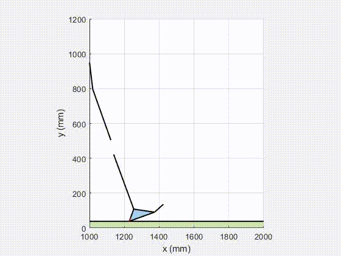
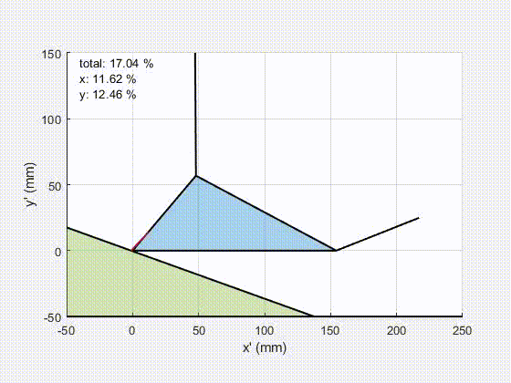

# Composite Laminate Optimization for Prosthetic Feet
Here, you'll find MATLAB codes for our prosthetic foot optimization project. These scripts cover gait cycle animation, classical lamination theory calculations, and genetic algorithm optimization. You can explore, use, and adapt these codes for your projects. If you have ideas or feedback, don't hesitate to share!

**Group members:**\
Mehmet Furkan Doğan[^1], Ali Fuat Şahin[^1], Wissam Lasfar[^1], and Ulysse Adam Louis Closet[^1]
[^1]: Section of Mechanical Engineering, École Polytechnique Fédérale de Lausanne

## MATLAB Scripts

### `CLT_Calculations.m`
 This script computes stresses and strains for a specified laminate configuration, patient weight, and shoe size at each time-step. Strength ratios are subsequently calculated using various failure criteria, emphasizing the most critical time-step. The necessary inputs include:
```MATLAB
core = false; % existence of core material at the center

load('Materials/Cycom 381 IM7 UD.mat') % Composite Material

if core == true
    load("Materials\Rohacell.mat")
    t_core = 4e-3;  % Core thickness in m
end
design_mass = 110;  % Patient's mass in kg
shoe_size = 42;     % Shoe size in eu standard
upper = [0, 0, 0, 0, 0, 0, 0, -45, 45, 0, 0, 0, 90, 0, 0];  % Orientations of the fibers for the upper kneel
lower = [0, 0, 0, 0, 45, -45, 0, 0]; % Orientations of the fibers for the lower kneel
```
---
### `CLT.m`
Similar to CLT_Calculations.m, this is presented in function form. The only distinction lies in its consideration of both inner and outer contact cases when calculating the strength ratio. This function is specifically utilized for optimization purposes.

---
### `optim.m`
This script employs a genetic algorithm to optimize the output of the `CLT.m` function. The optimization spans laminate numbers between `laminaMin` and `laminaMax`, with the results being saved to a `theta.mat` file as a cell array containing the optimized configurations.

---
### `optim_postprocessor.m`
This script visualizes the results obtained through optimization. It plots the weight and strength ratio of the optimized configurations for various numbers of laminae.

---
### `gait_cycle_animation.m`
This script is employed for visualizing gait data and calculating the forces exerted on the foot during a stance gait. The results are saved to `gait_forces.mat`.



---
### `save_material_properties.m`
This script saves material properties to `.mat` files in the `.\Materials\` folder.